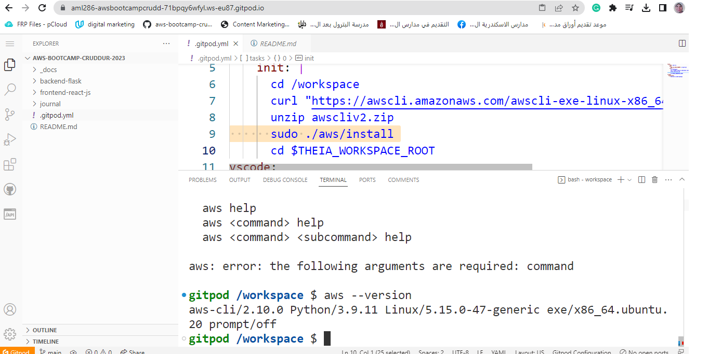
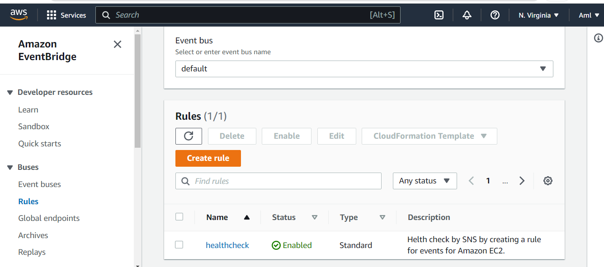
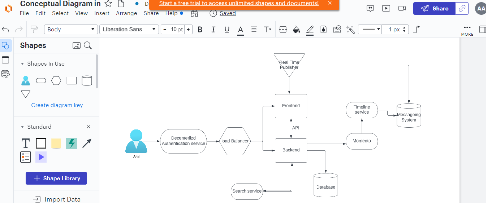

# Week 0 — Billing and Architecture
## required homework/tasks
## install aws cli , I did it
I am providing the instruction I used for my configuration
I did follow these instructions

```
tasks:
  - name: aws-cli
    env:
      AWS_CLI_AUTO_PROMPT: on-partial
    init: |
      cd /workspace
      curl "https://awscli.amazonaws.com/awscli-exe-linux-x86_64.zip" -o "awscliv2.zip"
      unzip awscliv2.zip
      sudo ./aws/install
      cd $THEIA_WORKSPACE_ROOT
  ```
  
## Generate AWS Credentials	
I tried several time to update access key but I get emails from aws that my account publicly compromised 
and I should delete these keys or my account will be suspended


##  I created a lucid chart for a logical diagram 


 Here is the [link for the logical diagram](https://lucid.app/lucidchart/07998726-1ecc-4eba-bbde-b847efbdfa4d/edit?viewport_loc=-1831%2C320%2C3347%2C1448%2C0_0&invitationId=inv_6793fffa-ed59-4092-9c91-63c57fc69b3b)
 
  ## I used the aws cloud shell and here is an image from it
  
  ## I created more than one  budget and here is a screenshot of them
  
  
  ## I Recreate Conceptual Diagram in Lucid Charts 
  Conceptual Diagram image 
  
  And this is the link of the diagram
  [link for the logical diagram](https://lucid.app/lucidchart/8da839b3-6487-4961-b7a0-29c3a0f576aa/edit?viewport_loc=61%2C123%2C1967%2C858%2C0_0&invitationId=inv_fef7c063-f0f8-4200-85b5-059d5860b99b)
  
       
       

   ##**Home work challenges**


   I created a billing alarm using the was console
   

  ##I used Use EventBridge to hookup Health Dashboard to SNS and send notification when there is a EC2 health issue so I  created an health check by the console
   
   ## I Open a support ticket and request for increasing  Container Services (ECS)
   here is the image of the ticket 
    


