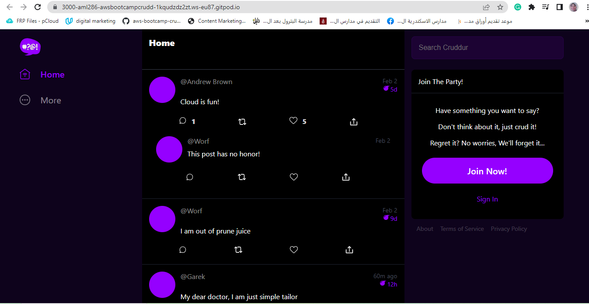

# Week 1 — App Containerization
I created a docker file for backend and then build the container then I run the container
then I created the frontend docker file and then I build the compose up.yml
I opened the port 3000 and 4567
then I got the website frontend
Here is the link https://3000-aml286-awsbootcampcrudd-1kqudzdz2zt.ws-eu87.gitpod.io/
and here is the screenshot 
  
  
